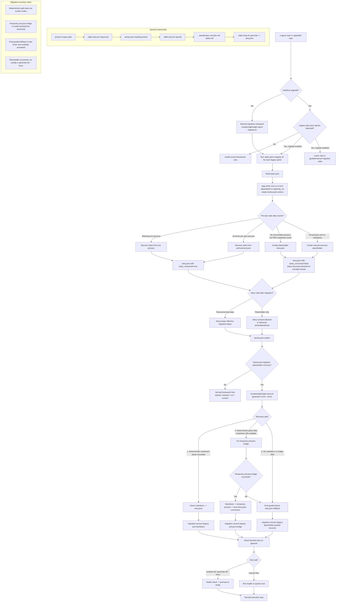

# Migration Diagram

This diagram shows the full legacy-to-story-task migration flow, including install-time upgrade, sprint container migration, placeholder creation, and all post-migration recovery paths.

## Reading Guide

- `ralph-sprint-migrate.sh` handles sprint container migration and first-pass task recovery.
- `ralph-story.sh generate --force` handles placeholder repair after migration.
- `SpecKit` is part of the normal modern story preparation flow, not the core legacy migration pipeline.
- The temporary `prd.json` bridge is only used as an intermediate recovery step for legacy markdown when deterministic parsing is not enough.
